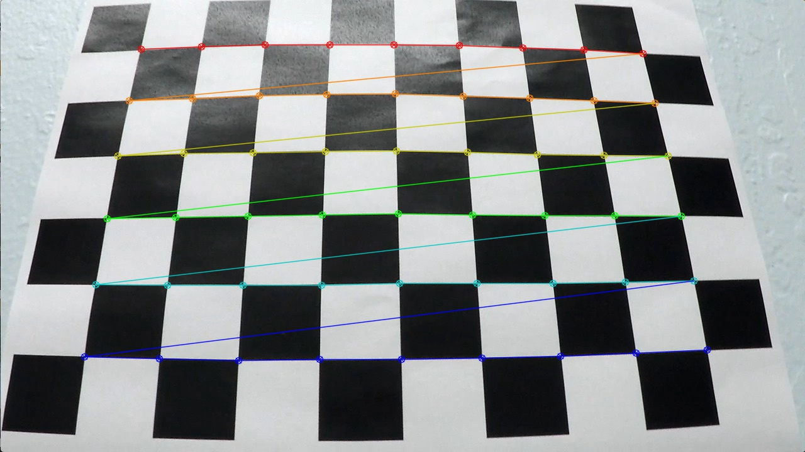
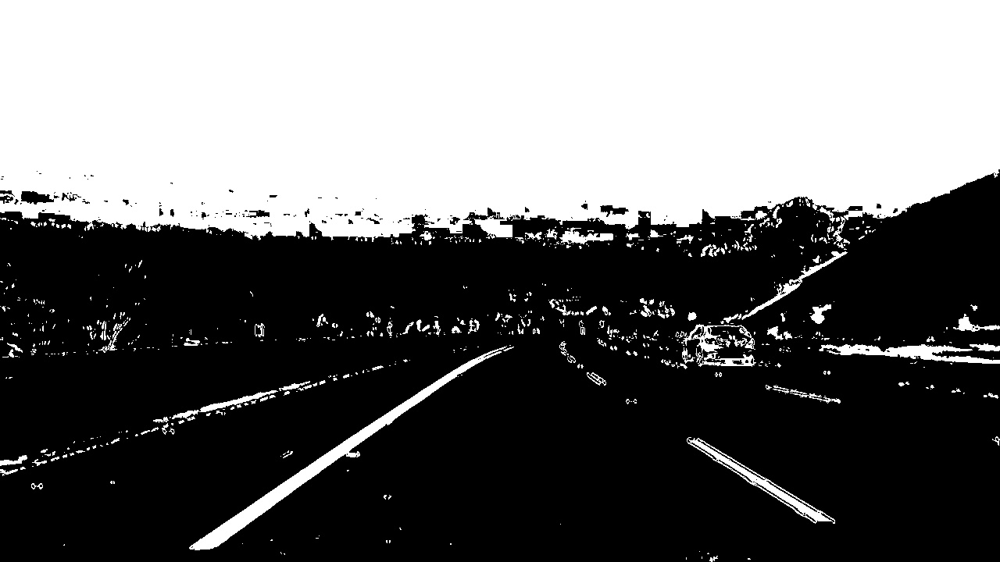
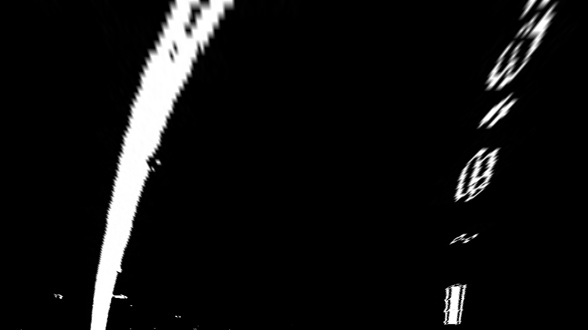
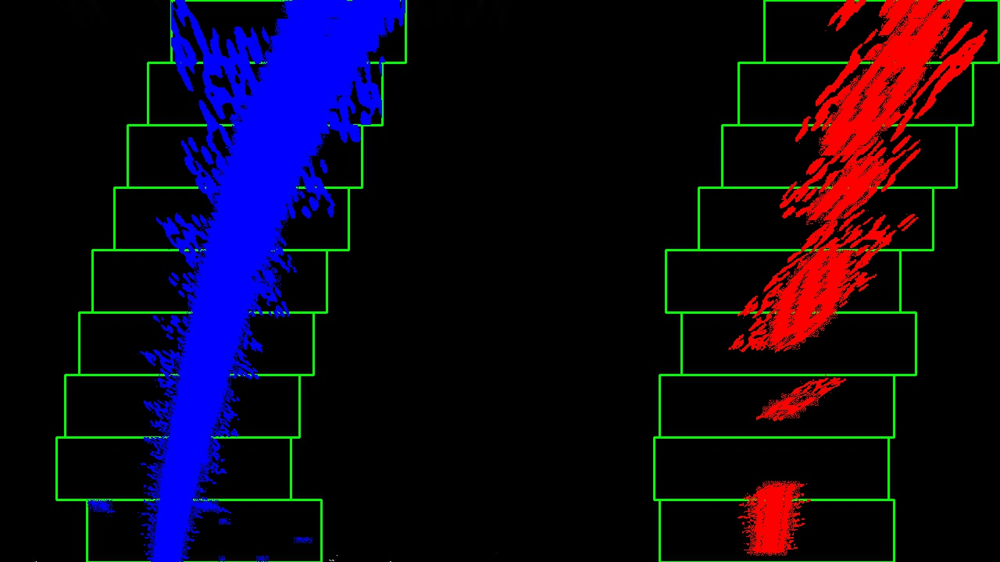
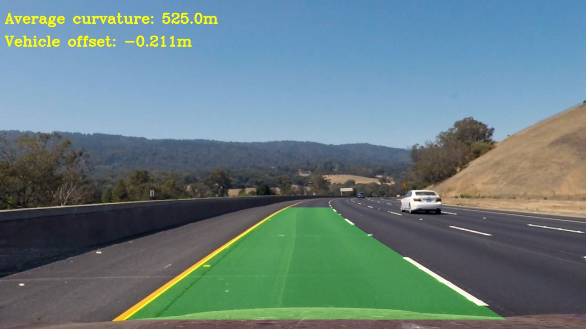

# Advanced Lane Finding

This project explains the steps in finding the lane lines:

* Compute the camera calibration matrix and distortion coefficients given a set of chessboard images.
* Apply a distortion correction to raw images.
* Use color transforms, gradients, etc., to create a thresholded binary image.
* Apply a perspective transform to rectify binary image ("birds-eye view").
* Detect lane pixels and fit to find the lane boundary.
* Determine the curvature of the lane and vehicle position with respect to center.
* Warp the detected lane boundaries back onto the original image.
* Output visual display of the lane boundaries and numerical estimation of lane curvature and vehicle position.

The goal of this project is to successfully identify the lane lines in both the test images and the video, and the output image stream should look similar to the following image:


## Camera Calibration and undistortion
*Briefly state how you computed the camera matrix and distortion coefficients. Provide an example of a distortion corrected calibration image.* 

The camera calibration was done by using the chessboard images provided in the project. As taught in the module, I used the `cv2.findChessboardCorners` function to find the chessboard corners and thereby `cv2.calibrateCamera` to calibrate the camera. Following are the steps used to calibrate the camera

1. Define the size of the corners 
2. Prepare the object points
3. Read in the image and covert it to grayscale
4. Pass the grayscaled image to `cv2.findChessboardCorners` function to find the corners in the image
5. Pass the original image to `cv2.drawChessboardCorners` function to draw and display the corners
6. Once the image points and object points are identified, use the `cv2.calibrateCamera` function to find the camera matrix and distortion coefficients
7. Use the `cv2.undistort` function to undistort the image.


The resulting undistorted image looks similar to the following:

camera_cal/calibration3.jpg      | camera_cal_output/calibration3.jpg
:------------------------------: | :--------------------------------------:
 | 

## Pipeline (test images)
* *Provide an example of a distortion-corrected image.*
* *Describe how (and identify where in your code) you used color transforms, gradients or other methods to create a thresholded binary image. Provide an example of a binary image result.*
* *Describe how (and identify where in your code) you performed a perspective transform and provide an example of a transformed image.*
* *Describe how (and identify where in your code) you identified lane-line pixels and fit their positions with a polynomial?*
* *Describe how (and identify where in your code) you calculated the radius of curvature of the lane and the position of the vehicle with respect to center.*
* *Provide an example image of your result plotted back down onto the road such that the lane area is identified clearly.*

Here is an example (test_images/test3_undist.jpg) of a distortion corrected image. 


<center> <i> test_images/test3_undist.jpg </i> </center>


### Binary thresholding

Here is the pipeline and threshold parameters for creating the gradient binary image: 

```python
# Define a gradient threshold pipeline
def grad_threshold_pipeline(image,mtx,dist):
    # Undistort the image
    undistImg = cv2.undistort(image, mtx, dist, None, mtx)
    # Calculate binary outputs from sobel thresholding
    gradx = abs_grad_sobel_threshold(undistImg, orient='x', sobel_kernel=sobel_kernel_grad_abs, thresh=grad_abs_thresh)
    grady = abs_grad_sobel_threshold(undistImg, orient='y', sobel_kernel=sobel_kernel_grad_abs, thresh=grad_abs_thresh)
    mag_binary = mag_sobel_threshold(undistImg, sobel_kernel=sobel_kernel_grad_mag, thresh=grad_mag_thresh)
    dir_binary = dir_sobel_threshold(undistImg, sobel_kernel=sobel_kernel_grad_dir, thresh=grad_dir_thresh)
    # Calculate binary outputs from color thresholding for 'S' channel in HLS color space
    R_binary = color_threshold_RGB(image, color_channel='R', RGB_thresh=R_thresh)
    S_binary = color_threshold_HLS(undistImg, color_channel='S', HLS_thresh=S_thresh)
    H_binary = color_threshold_HLS(image, color_channel='H', HLS_thresh=H_thresh)
    # Compute combined_binary
    combined = np.zeros_like(dir_binary)
    combined[(gradx == 1) | ((S_binary == 1)) | ((mag_binary == 1) & (dir_binary == 1))] = 1
    return combined

# Custom threshold definitions
grad_abs_thresh = (40, 100)  
grad_mag_thresh = (40, 100)  
grad_dir_thresh = (0.7, 1.3)
sobel_kernel_grad_abs = 5  
sobel_kernel_grad_mag = 9   
sobel_kernel_grad_dir = 9  
R_thresh = (220, 255)  
S_thresh = (90, 255) 
H_thresh = (15, 100) 
```

Here, I am using the threshold logic as `combined[(gradx == 1) | ((S_binary == 1)) | ((mag_binary == 1) & (dir_binary == 1))] = 1`.


The resulting binary thresholded image is shown as below: 

Original test image (test_images/test3.jpg)     | Binary thresholded test image (test_images_output/test3.jpg)
:------------------------------: | :--------------------------------------:
 | 

### Perspective transform

Here I use the following as source and destination points on the original and perspective trasformed image.

|source| destination |
|---| ---|
|[246,700]|[200,720]|
|[620,454]|[400,0]|
|[728,454]|[1200,0]|
|[127,700]|[1000,1420]|

I then used the following functions to get the warped image: 

```python
M = cv2.getPerspectiveTransform(src, dst)
warped = cv2.warpPerspective(img, M, img_size)
```

The resulting warped image is shown below: 


  
<center> <i> Warped image after perspective transform (test_images_output/test3_warped.jpg) </i> </center>

### Identifying lane line pixels and polynomial fitting

I follow the sliding window methonf to identify the lane line pixels. Here for this pipeline, I have written a seperate function called `findStartingLines` to identify the start points of the left and right lanes from the bottom of the image using the histogram method:

```python
def findStartingLines(binary_warped):
    # Take a histogram of the bottom half of the image
    histogram = np.sum(binary_warped[binary_warped.shape[0]//2:,:], axis=0)
    
    # Find the peak of the left and right halves of the histogram
    # These will be the starting point for the left and right lines
    midpoint = np.int(histogram.shape[0]//2)
    leftx_base = np.argmax(histogram[:midpoint]) #argmax returns only the index, not the actual value
    rightx_base = np.argmax(histogram[midpoint:]) + midpoint
    return leftx_base, rightx_base
```

This way, I can call this function when I have no previous information of the lane lines. When I have identified the lines in a given frame confidently, I can reuse the start points of the left and right lines at the base of the image for the next frame. The `leftx_base` and `rightx_base` are then be passed to the `find_lane_pixels` function to identify the lane pixels withing the rectangular windows. 

The `fit_polynomial` function calls the `find_lane_pixels` function to extract the non-zero pixels in the region of interest, and uses the numpy function `np.polyfit` function to fit a second order polynomial. 

Here is the piece of code which implements the above : 

```python
# Load our image
binaryWarpedTestImg = mpimg.imread('test_images_output/' + testImage + '_warped.jpg')

# Use histogram to find the base of left line and right line
leftx_base, rightx_base = findStartingLines(binaryWarpedTestImg)
out_img, left_fit, right_fit, left_fitx, right_fitx, ploty = fit_polynomial(binaryWarpedTestImg, leftx_base, rightx_base)
# Plots the left and right polynomials on the lane lines
plt.plot(left_fitx, ploty, color='yellow')
plt.plot(right_fitx, ploty, color='yellow')

print(left_fitx[left_fitx.shape[0]-1])
print(right_fitx[left_fitx.shape[0]-1])

plt.imshow(out_img)
#plt.imshow(binaryWarpedTestImg)
cv2.imwrite('test_images_output/' + testImage + '_lanelinefitted.jpg', out_img)
```

The resulting lane-line identified image is shown below: 

 
<center> <i> Lane line fitted (./test_images_output/test3_lanelinefitted.jpg) </i> </center>


### Radius of curvature and vehicle position
I finally use the `measure_curvature_real` function to calculate the radius of curvature in pixels. The radius of curvatures of left and right lines are then converted from pixel to m scale using the following conversion factors: 

```python
# Define conversions in x and y from pixels space to meters
ym_per_pix = 30.0/720 # meters per pixel in y dimension
xm_per_pix = 3.7/700 # meters per pixel in x dimension
```

For the test3.jpg image shown above, I got a radius of curvature of 1169.73505706m and 500.795034004m for left and right lines respectively.

### Plotting lane area and info on original image
Using the `cv2.warpPerspective` function, the warped lane area can be recast to original perspective. Finally using the `DrawLaneArea` and `DrawInfo` function, the lane area and info can be superimposed on the original image as shown below: 

 
<center> <i> Lane line warped back and superimposed on original image (./output_images/test3.jpg) </i> </center>

## Pipeline (video)
*Provide a link to your final video output. Your pipeline should perform reasonably well on the entire project video (wobbly lines are ok but no catastrophic failures that would cause the car to drive off the road:* 

### Video Pipeline 
For the pipeline for video processing, I defined the `findLaneLinesVideo` function, which takes in one image frame of the video at a time. This function comprises of all the above steps which were discussed above: 

```python
def findLaneLinesVideo(imageFrame_video):
    # Flag to know whether the lines in at least one frame is detected
    lanelineIdentified_video = 0
    
    # Read in image file and undistort
    origUndistImg_video = UndistortImage(imageFrame_video, mtx, dist)
    
    # Apply gradient and color thresholds on undistorted image to return combined binary image
    undistCombinedBinary_video = grad_threshold_pipeline(origUndistImg_video,mtx,dist)
    
    # Define source and destination points for the 'undistCombinedTestImg'
    cols_video, rows_video = undistCombinedBinary_video.shape[::-1]
    top_limit_video = 454 #450 # np.int(rows * 0.635)
    down_limit_video = 700 # rows - 20
    src_point1_video = [246, down_limit_video]  #[280, down_limit] 
    src_point2_video = [620,top_limit_video] #[628, top_limit] # [590, top_limit]
    src_point3_video = [728, top_limit_video] #[724, top_limit] # [725, top_limit]
    src_point4_video = [1127, down_limit_video] # [1125, down_limit]
    src_video = np.float32([src_point1_video, src_point2_video, src_point3_video, src_point4_video])
    dst_point1_video = [200, rows_video]
    dst_point2_video = [400, 0]
    dst_point3_video = [1200, 0]
    dst_point4_video = [1000, rows]
    dst_video = np.float32([dst_point1_video, dst_point2_video, dst_point3_video, dst_point4_video])
    
    #warped, M = warpUndistortedImage(combined_binary)
    warpedCombinedBinary_video, M_video = perspective_transform(undistCombinedBinary_video, src_video, dst_video)
    
    #warpedCombinedBinary, M, _, _ = warpUndistCombinedImg(undistCombinedBinary, origUndistImg, src, dst)
    if (lanelineIdentified_video==0):
        leftx_base_video, rightx_base_video = findStartingLines(warpedCombinedBinary_video)
        warpedLineFitted_video, left_fit_coeffs_video, right_fit_coeffs_video, left_fitx_video, right_fitx_video, ploty_video = fit_polynomial(warpedCombinedBinary_video, leftx_base_video, rightx_base_video)
    else: 
        warpedLineFitted_video, left_fit_coeffs_video, right_fit_coeffs_video, left_fitx_video, right_fitx_video, ploty_video = fit_polynomial(warpedCombinedBinary_video,leftx_base_video_prev, rightx_base_video_prev)
        lanelineIdentified_video = 1
        
    # Save the bottom pixel in x-direction of left and right lane for the next frame  
    leftx_base_video_prev = left_fitx[left_fitx.shape[0]-1]
    rightx_base_video_prev = right_fitx[left_fitx.shape[0]-1]

    
    # Define conversions in x and y from pixel-space to meters
    ym_per_pix_video = 30.0/720 # meters per pixel in y dimension
    xm_per_pix_video = 3.7/700 # meters per pixel in x dimension

    # Calculate the radius of curvature in meters for both lane lines
    left_curverad_video, right_curverad_video = measure_curvature_real(undistCombinedBinary_video.shape, left_fit_coeffs_video, right_fit_coeffs_video, ym_per_pix_video, xm_per_pix_video)
    vehicleOffset_video = GetVehicleOffset(undistCombinedBinary_video.shape, left_fit_coeffs_video, right_fit_coeffs_video, xm_per_pix_video)

    M3_video = cv2.getPerspectiveTransform(dst_video, src_video)
    newWarpLaneArea_video = DrawLaneArea(warpedCombinedBinary_video, ploty_video, left_fitx_video, right_fitx_video, M3_video)

    # Combine the result with the original image
    resultAddWeighted_video = cv2.addWeighted(origUndistImg_video, 1, newWarpLaneArea_video, 0.3, 0)

    # Draw curvature and vehicle offset info onto the final image
    resultFinal_video = DrawInfo(resultAddWeighted_video, (left_curverad_video, right_curverad_video), vehicleOffset_video)
    return resultFinal_video
```

Here, the flag `lanelineIdentified_video` is used to identify if the lane lines of previous frame were identified or not. This improves the processing speed, as the information from previous frame can be reused to find the start points of the left and right line bases on the X-axis. 

Following is the code snippet to run the pipeline on individual videos:

### Test of video pipeline

```python
########## project_video.mp4 #############

clip1 = VideoFileClip(testVideoFiles[0])
white_clip = clip1.fl_image(findLaneLinesVideo) #NOTE: this function expects color images!!

white_clip_output = 'test_videos_output/' + testVideoFiles[0]
%time white_clip.write_videofile(white_clip_output, audio=False)
```

The resulting video is available here: [project_video.mp4](https://drive.google.com/drive/folders/1O8qIZKktLTBUH1p9hLJ_ll3xb4NEJd1e)

## Discussion 

The pipeline uses the basic principles discussed in the modules and therefore works well for the **project_video.mp4** video. However, more robust pipeline is needed for **challenge_video.mp4** and **harder_challenge.mp4** because of shadows, and highly curved lanes. This can be achieved by 

1. Experimenting various gradient threshold filter and color threshold combinations 
2. Experimenting various thresholds for filters 
3. Low-pass filtering of lane lines to avoid jitters and rejecting outliers