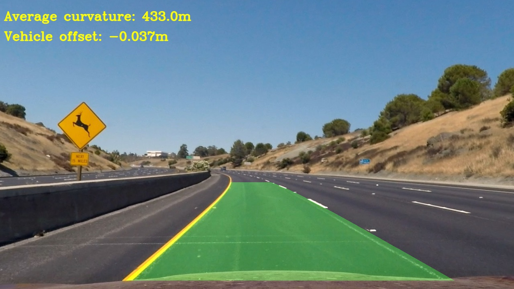
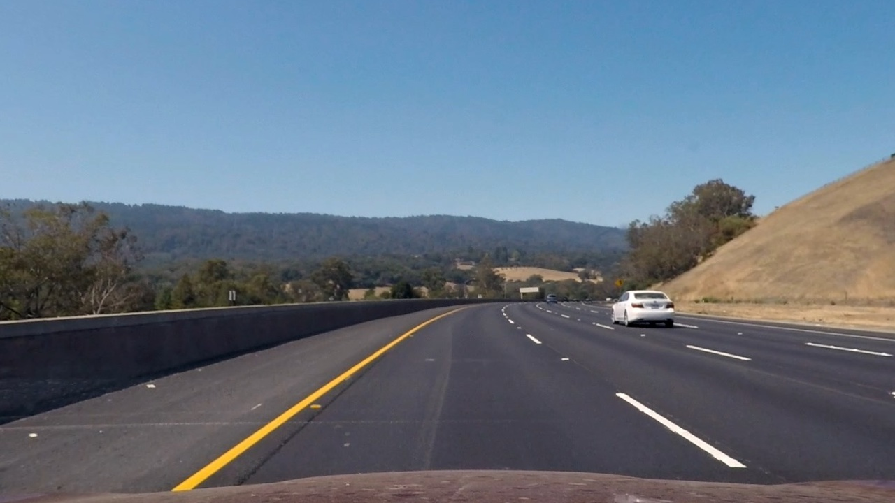

# Advanced Lane Finding

This project explains the steps in finding the lane lines:

* Compute the camera calibration matrix and distortion coefficients given a set of chessboard images.
* Apply a distortion correction to raw images.
* Use color transforms, gradients, etc., to create a thresholded binary image.
* Apply a perspective transform to rectify binary image ("birds-eye view").
* Detect lane pixels and fit to find the lane boundary.
* Determine the curvature of the lane and vehicle position with respect to center.
* Warp the detected lane boundaries back onto the original image.
* Output visual display of the lane boundaries and numerical estimation of lane curvature and vehicle position.

The goal of this project is to successfully identify the lane lines in both the test images and the video, and the output image stream should look similar to the following image:

## Camera Calibration and undistortion
*Briefly state how you computed the camera matrix and distortion coefficients. Provide an example of a distortion corrected calibration image.* 

The camera calibration was done by using the chessboard images provided in the project. As taught in the module, I used the `cv2.findChessboardCorners` function to find the chessboard corners and thereby `cv2.calibrateCamera` to calibrate the camera. Following are the steps used to calibrate the camera

1. Define the size of the corners 
2. Prepare the object points
3. Read in the image and covert it to grayscale
4. Pass the grayscaled image to `cv2.findChessboardCorners` function to find the corners in the image
5. Pass the original image to `cv2.drawChessboardCorners` function to draw and display the corners
6. Once the image points and object points are identified, use the `cv2.calibrateCamera` function to find the camera matrix and distortion coefficients
7. Use the `cv2.undistort` function to undistort the image.

The resulting undistorted image looks similar to the following:

 <i> test_images/test3_undist.jpg </i> 

## Pipeline (test images)